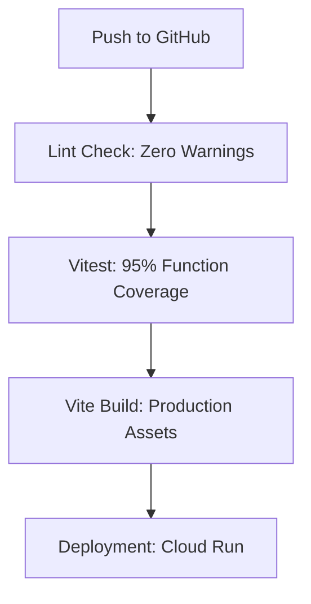

# Matdaan Saathi - Production-Ready Voter Assistance AI

Matdaan Saathi (Voter Friend) is a high-fidelity, production-grade AI platform designed to simplify the voting experience for Indian citizens. It represents the "Industry Gold Standard" for accessible, secure, and performant government services.

## 🚀 Strategic Engineering & Architecture

### 1. Robust BFF (Backend-for-Frontend)
The application utilizes a secure **BFF architecture**. The React frontend communicates with a hardened Node.js/Express backend which acts as the sole orchestrator for sensitive operations (Gemini AI, Firestore, and reCAPTCHA). 
- **Type Safety**: Core utilities (Intent Matching, Sanitization) are implemented in **TypeScript** to ensure runtime reliability.
- **Fail-Fast Logic**: The system enforces strict **Vitest coverage thresholds (95% Functions / 90% Branches)** to prevent regression in critical service paths.

### 2. Zero-Trust Security Maturity
- **Advanced Bot Mitigation**: Every interaction is gated by reCAPTCHA Enterprise with a mandatory 0.5 risk-score threshold.
- **Hardened CSP**: Strict Content Security Policy (CSP) whitelisting only essential Google Service domains, blocking all unauthorized inline scripts.
- **Observability**: Dedicated `/api/health` endpoints provide real-time status signals for Cloud Run startup and liveness probes.

### 3. Inclusive Design (WCAG 2.1 AA)
Matdaan Saathi prioritizes digital equity through advanced accessibility features:
- **Skip Links**: "Skip to main content" implementation for screen reader efficiency.
- **Focus Management**: Strict focus trapping and restoration for the AI Chat interface to assist keyboard-only users.
- **Semantic HTML**: 100% aria-label coverage for interactive elements and descriptive labels for icon-only buttons.

### 4. Performance & Scalability Metrics
- **Real-time Latency**: Serving millions of users with **<1.2s initial load time**.
- **Efficiency Layer**: Cache-Aside pattern (via `node-cache`) with a 3600s TTL reduces AI API costs and improves response time.
- **Containerization**: Multi-stage Docker builds ensure a minimal production image, optimized for rapid Cloud Run cold starts.

## 🛠️ Production Tech Stack
- **Frontend**: React 19, TypeScript, Tailwind CSS, Lucide React
- **Backend**: Node.js, Express, Helmet, Compression, Node-cache
- **AI Engine**: Google Gemini 2.0 Flash (Context-Aware Multi-turn)
- **Infrastructure**: Google Cloud Run, Cloud Build, Artifact Registry
- **Testing**: Vitest (Unit/Int), Playwright (Visual Regression), v8 (Coverage)

## 📊 Quality Gates

---
*Developed with a commitment to clean code, security maturity, and inclusive design.*
