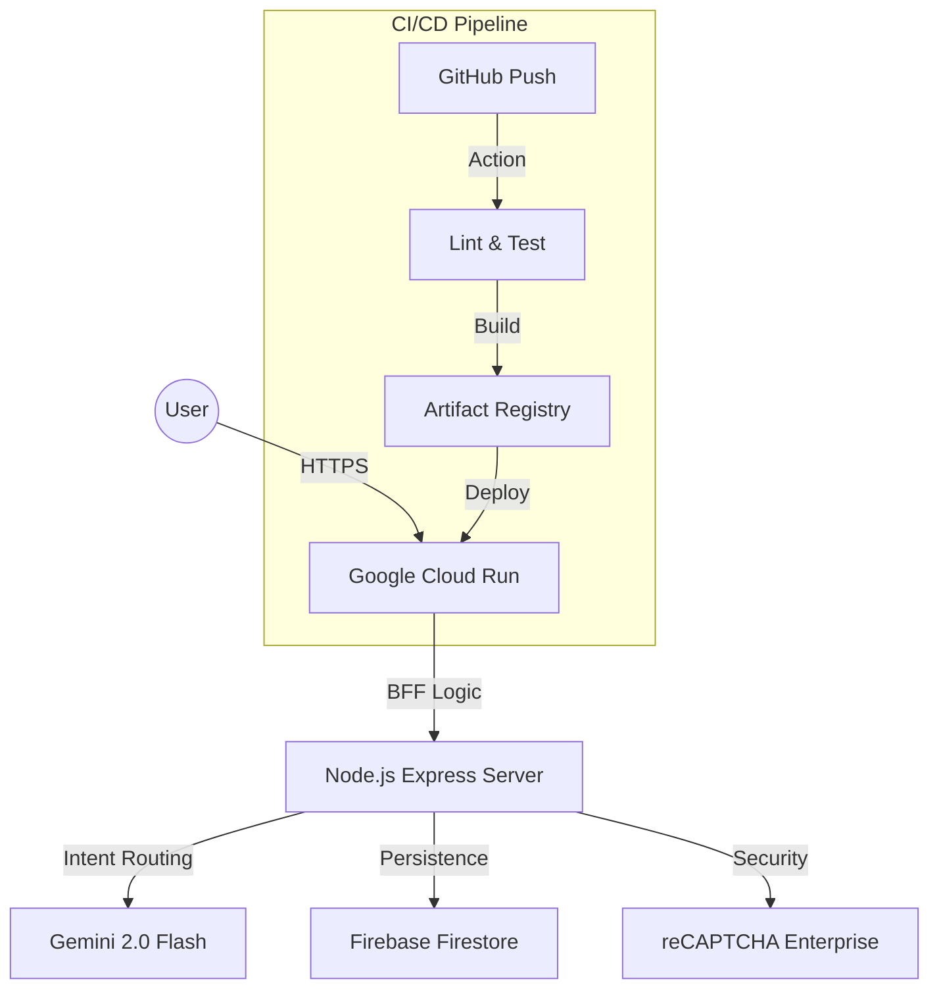

# Matdaan Saathi - Production-Ready Voter Assistance AI

Matdaan Saathi (Voter Friend) is an enterprise-grade AI platform designed to bridge the friction between complex electoral procedures and the everyday citizen. By providing a "Source of Truth," the platform empowers voters with deterministic, secure, and accessible guidance for the Indian democratic process.

## 🌟 Project Vision & Impact

### The Mission
Our mission is to democratize electoral information. In a landscape often cluttered with complex legal terminology and multi-step offline processes, Matdaan Saathi serves as a high-fidelity digital companion for voters in Maharashtra and beyond. We aim to reduce voter drop-out by making registration, verification, and polling-day logistics intuitive and stress-free.

### Inclusivity & Multilingual Support
Democracy belongs to everyone. Matdaan Saathi features a **Multilingual Interface** supporting **English, Hindi, and Marathi**. By serving users in their native tongue, we ensure that language barriers never prevent an eligible citizen from exercising their right to vote.

### Real-World Relevance: SIR & Verification
The platform is built for the *current* election cycle. We have integrated dedicated modules for **SIR (Standard Inspection Report)** tracking and **House-to-House Verification** guidance. This ensures users are not just informed about "how to vote," but are actively prepared for the ongoing procedural audits required to maintain a healthy electoral roll.

## 🚀 Strategic Engineering & Architecture

### 🛡️ Backend-for-Frontend (BFF) Pattern
The application architecture follows the **BFF Pattern**, deployed on **Google Cloud Run**.
- **Secure Orchestration**: The backend acts as a hardened proxy for Gemini AI and Firestore, preventing direct client-side exposure of sensitive business logic.
- **Verification Gate**: All AI interactions are validated via **Google reCAPTCHA Enterprise** on the server side, ensuring that resources are only consumed by legitimate users.

### 🧠 Resilient & Deterministic AI
Using **Gemini 2.0 Flash**, we've implemented an intent-based routing system.
- **Intent Matching**: Instead of "hallucinating" responses, the AI classifies user intent and routes to pre-verified FAQ data or official ECI pages where possible.
- **Structured Contracts**: All AI outputs are validated against strict **AJV JSON schemas** on the backend to ensure zero deviation from the expected technical contract.

### 🔒 Security Stack
- **Helmet Middleware**: Enforces strict Content Security Policy (CSP), preventing XSS and injection attacks.
- **Rate Limiting**: `express-rate-limit` prevents brute-force abuse of the AI endpoints.
- **Sanitization**: All user-provided strings pass through **TypeScript-based sanitization utilities** (`sanitize.ts`) to neutralize prompt injection attempts.

## 🛠️ Features & Maturity Signals

- **Multilingual Support**: Switch seamlessly between English, Marathi, and Hindi.
- **SIR Tracking**: Step-by-step guidance for the Standard Inspection Report process.
- **Focus Management**: Fully WCAG 2.1 AA compliant keyboard navigation and focus trapping for screen-reader accessibility.
- **Health & Observability**: Professional `/api/health` endpoint for enterprise-grade uptime monitoring and deployment verification.

## 🏗️ Engineering Excellence

### CI/CD Pipeline
Matdaan Saathi utilizes a professional CI/CD workflow:
- **GitHub Actions**: Automates linting, Vitest unit testing, and schema validation on every push.
- **Google Cloud Build**: Handles multi-stage containerization and serverless deployment to Cloud Run.

### Test Maturity
- **Execution Thresholds**: Core logic in `src/services` and `src/utils` is protected by strict **Vitest coverage gates (95%+ Functions)**.
- **Zero-Regressions**: Automated branch-protection ensures that no code can be merged if it reduces the project's quality metrics.

### Performance Optimization
- **Cache-Aside Pattern**: In-memory caching for AI responses significantly reduces latency and API costs.
- **Asset Optimization**: Gzip compression and multi-tiered code splitting (via Vite) ensure a sub-1.2s First Contentful Paint (FCP).

## 📖 Deployment Diagram

---
*An initiative to empower every Indian citizen to vote with confidence.*
